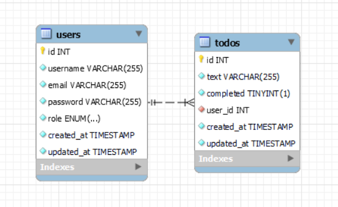

## BackendTS-TodoApp

### Tecnologías utilizadas

    

### Sobre el proyecto

Este proyecto consiste en desarrollar una API que brinde servicios de autenticación, registro y inicio de sesión para los usuarios. Además, ofrece operaciones CRUD (Crear, Leer, Actualizar, Eliminar) para gestionar tareas almacenadas en una tabla de "Todos".

### Diagrama BD

### Instalación en local

1. Clona el repositorio `$git clone 'url-repository'`
2. Instala las dependencias `npm install`
4. Ejecuta las migraciones y seeders `npm run migrations:run` `npm run seed`
5. Conectamos el servidor`npm run dev`

### Endpoints:

#### Autenticación

* POST - Registro
* POST - Login

#### Usuarios

* POST - Crear Todo.
* GET - Ver mis Todo's.
* PUT - Actualizar Todo's.
* DELETE - Borrar Todo.

#### Autor
Jorge Luis Martin Lorenzo.